# OfferPilot 🌿 — AI Job-Search Copilot

**Live:** [offerpilot-beryl-beta.vercel.app](https://offerpilot-beryl-beta.vercel.app) · Open-source (MIT) · Built & shipped solo with Claude

An AI copilot for new-grad job seekers: aggregates fresh postings daily from 8 open sources, scores resume–JD fit with structured LLM outputs, drafts tailored resume bullets under strict guardrails, and tracks the full application pipeline — saved → applied → referral → interview → offer/rejected.

Built from a real pain point (my own job search), iterated daily from real usage. Every AI design decision below came from an actual failure observed in production.

---

## Product Architecture

```mermaid
flowchart LR
  subgraph Data["📥 Job Discovery"]
    A[8 open-source job repos<br/>jobright / SimplifyJobs / vansh] --> B[Multi-format parsers<br/>Markdown + HTML]
    B --> C[Relevance & eligibility filters<br/>role match · seniority · visa markers 🛂🇺🇸 ·<br/>graduation-window rules]
    C --> D[Dedup + classify<br/>PM / UX-PD / HW / PjM / Ops]
  end
  subgraph Core["🗂 Tracking Core"]
    D --> E[7-stage pipeline<br/>localStorage-persisted]
    E --> F[Dashboard<br/>funnel · trends · Today's Picks<br/>rule-based scoring engine]
  end
  subgraph AI["🤖 Resume Lab (BYO API key)"]
    G[Resume library] --> H[Analysis prompt<br/>structured JSON schema]
    I[Pasted JD] --> H
    H --> J[Truncation repair<br/>+ auto-retry ×2]
    J --> K[Report: match score · ATS keywords ·<br/>persona decode · guarded bullet rewrites ·<br/>elicitation questions]
    K --> L[Refine via chat<br/>human-in-the-loop iteration]
    L --> K
  end
  F -.pick a job.-> I
```



**Stack:** React 18 + Vite · Recharts · Claude API (claude-sonnet-4-6, structured outputs) · localStorage persistence · Vercel CI/CD (push-to-deploy)

**Privacy by design:** public code ships only demo data; all user data (resumes, pipeline, API key) lives exclusively in the user's browser localStorage. BYO-key means zero server-side secrets. (This separation was itself a lesson — see decision log #5.)

---

## AI Design Decisions (from real failures)

| # | Observed failure | Root cause | Fix shipped | Result |
|---|---|---|---|---|
| 1 | Rewritten bullets silently **dropped brand names** (e.g. a client name that anchors credibility) | Model optimizing for brevity treats proper nouns as expendable | **Preservation guardrails**: prompt-level protected list — brand names, metrics, ownership verbs must survive every rewrite; each change ships with a stated reason | Zero brand-drop recurrences in subsequent use |
| 2 | Long analyses returned **truncated / broken JSON** | max_tokens ceiling hit mid-structure | Compressed output schema + hard caps per field + **JSON repair pipeline + auto-retry (×2)** | Analysis success rate recovered to ~100% |
| 3 | Rewrites **inflated word count** with filler ("to support...", repeated nouns) | Model equates longer with better | **Length discipline rule**: rewrite ≤ original +10%, density over length, cross-bullet dedup | Tighter bullets; user-confirmed usable output |
| 4 | Suggestions assumed experiences the user never mentioned; or missed experiences the resume omitted | One-shot analysis can't see beyond the text | **Elicitation loop**: model asks up to 2 targeted questions about plausible missing experience; refine-chat merges answers into new drafts — never inventing facts | Human-in-the-loop drafting; hallucination surface reduced |
| 5 | Personal resumes were once **bundled into the public build** | Demo data and user data not separated at design time | Full repo rebuild: sanitized seeds ("Alex Sample"), user data strictly client-side, privacy checks before every release | Public artifact safe to share; process now includes a privacy scan |

---

## Evals

The `/evals` folder contains a runnable consistency-evaluation harness — because an LLM feature isn't shippable until you can answer *"how stable is it?"*

**Methodology**
- **Golden set:** 10 real, public JD–resume pairs spanning all five role categories, each hand-labeled with an expected match band and expected must-have requirements
- **Consistency protocol:** each pair runs 3× with identical input; we measure match-score spread (range, stddev) and must-have detection overlap (Jaccard) across runs
- **Pass bar:** score range ≤ 12 points per pair; must-have Jaccard ≥ 0.6

Run it yourself:

```bash
cd evals
ANTHROPIC_API_KEY=sk-ant-... node run_evals.mjs   # ~30 calls, <$0.50
```

Results are written to `evals/results.md`. See `evals/README.md` for the full methodology and latest findings.

---


---

## Use it, or make it yours

**Just use it** — open the [live site](https://offerpilot-beryl-beta.vercel.app). Job tracking works out of the box; AI features need your own Anthropic API key (stored only in your browser). Your data never leaves your device.

**Deploy your own** — fork this repo → `npm install` → push to your Vercel (zero config). You get your own instance with your own data.

**Adapt it to your role** — OfferPilot is intentionally opinionated: it filters for product-family roles (PM / Product Design & UX / Hardware / Project Management / Ops) because focused filtering beats generic aggregation. But the sources already contain SWE, data, and other roles — extending is a two-function change in `src/App.jsx`:

1. `GH` array — add/remove source repos (any repo with a Markdown or HTML job table)
2. `isRelevant()` + `classifyType()` — swap the title regexes for your target roles

PRs that add role presets are welcome.

## Roadmap

- **v0.4** — post-interview retro module: transcript-based analysis by competency dimension, BQ story bank (STAR)
- **v0.5** — Supabase sync (cross-device), direct ATS-source ingestion (Greenhouse/Ashby APIs), pipeline conversion analytics

## Data sources & credits

Job data aggregated from the excellent open-source repos by [jobright-ai](https://github.com/jobright-ai), [SimplifyJobs](https://github.com/SimplifyJobs/New-Grad-Positions), and [vanshb03](https://github.com/vanshb03/New-Grad-2027) — star them; they do the daily heavy lifting.

MIT © Lukina Chen
